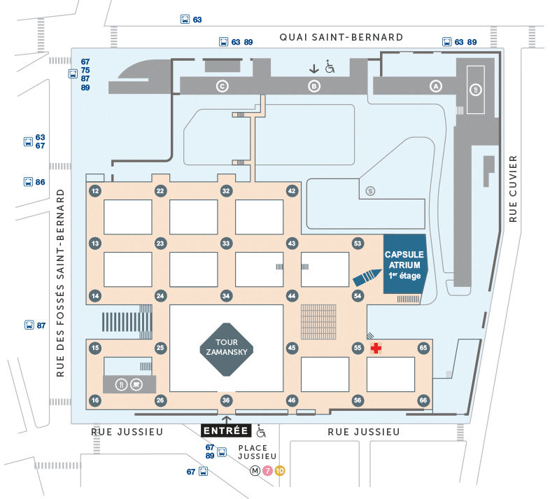

## Accelerate your omics analyses with InforBio

We provide biological researchers with statistical and bioinformatics expertise, analysis tools, and high performance computing resources.
Our team covers a broad range of applications, with specific core expertise in transcriptomics and epigenetics.

{width=500px}

## Contact Us

to create a google formula for the contact

nom/prenom:
lab / structure / organisme (optionel)
type de demande (memu deroulant): formation, infrastructure, collaboration, etc.
description/message
votre mail:

{width=500px}

{data-icon=laptop} service
{data-icon=graduation-cap} trainings
icon storage pour serveur de stockage

## Members

- Lorette Noiret - Scientific Head
- Naïra Naouar - Operation Manager
- Lijiao Ning - Engineer Statistician
- Abdel Mounim Essabbar - Research Fellow 
- Ivain Raslain - PhD Student
- Joe Ueda - Bioinformatician
