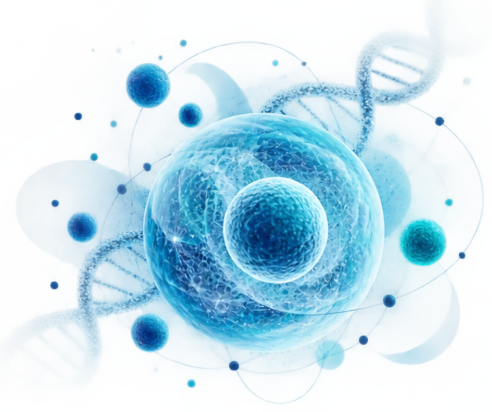
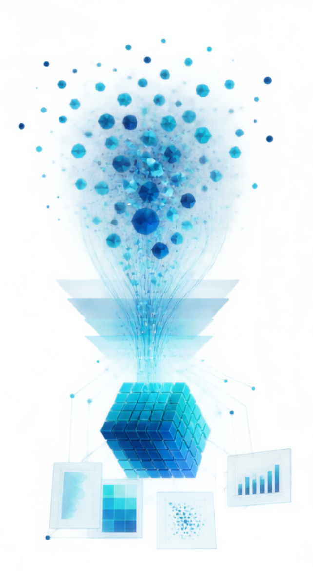

::: {.story-page}

<!-- =========================================================
01 — ABOUT INFORBIO
========================================================= -->

01

ABOUT INFORBIO

<h2>
Accelerate your
omics analyses.
</h2>

We provide biological researchers with statistical
and bioinformatics expertise, analysis tools, and
high performance computing resources.

Our team covers a broad range of applications,
with specific core expertise in transcriptomics
and epigenetics.

<!-- =========================================================
02 — FLASH TALKS / IOT / MATERIALS
========================================================= -->

02

Trainings

<h2>
Learn,
train, and explore.
</h2>

<a href="content/short_lectures.html"
class="feature-panel"
style="--panel-image: url('./images/css/p1.png');">

01

<h3>Flash Talks</h3>

30' short lectures on bioinformatics and statistics

↗

</a>

<a href="content/what_is_iot.html"
class="feature-panel"
style="--panel-image: url('./images/css/p2.png');">

02

<h3>IOT</h3>

InforBio Online Training

↗

</a>

<a href="content/materials.html"
class="feature-panel"
style="--panel-image: url('./images/css/p3.png');">

03

<h3>Materials</h3>

Training materials and resources

↗

</a>

<!-- =========================================================
03 — OUR EXPERTISE
========================================================= -->

03

OUR EXPERTISE

<h2>
From biological data
to insight.
</h2>

We support researchers throughout the analysis
of complex biological datasets, from sequencing
to quantitative and computational biology.

<a href="services.html">
01
Bioinformatics
</a>

<a href="services.html">
02
Bulk RNA-seq
</a>

<a href="iot_r_scrnaseq.html">
03
Single-cell RNA-seq
</a>

<a href="services.html">
04
Spatial Transcriptomics
</a>

<a href="services.html">
05
ChiSeq Analysis
</a>

<a href="services.html">
06
Image Analysis
</a>

<a href="services.html">
07
Data Visualization
</a>

<!-- =========================================================
04 — THE TEAM
========================================================= -->

04

THE TEAM

<h2>
Science is
collaborative.
</h2>

Our team brings together complementary expertise
in bioinformatics, biostatistics, biological analysis
and computational methods.

<a href="https://github.com/NoiretLorette">
<strong>Lorette Noiret</strong>
Scientific Head
</a>

<a href="https://github.com/NairaNaouar">
<strong>Naïra Naouar</strong>
Operation Manager
</a>

<a href="https://github.com/Ning-L">
<strong>Lijiao Ning</strong>
Biostatistician
</a>

<a href="https://github.com/mouneem">
<strong>Abdel Mounim Essabbar</strong>
Research Fellow
</a>

<a href="https://github.com/ivain-r">
<strong>Ivain Raslain</strong>
PhD Student
</a>

<a href="https://github.com/jueda99">
<strong>Joe Ueda</strong>
Bioinformatician
</a>

<!-- =========================================================
05 — CONTACT
========================================================= -->

05

CONTACT US

<h2>
Have a project
to discuss?
</h2>

Fill in the form below and our team will
get back to you.

<form
action="https://forminit.com/f/kxswvmzx46w"
method="POST"
accept-charset="UTF-8"
class="inforbio-contact"
>

<label for="name">Name</label>

<input
type="text"
name="fi-sender-fullName"
id="name"
required
>

<label for="email">Email</label>

<input
type="email"
name="fi-sender-email"
id="email"
required
>

<label for="message">Your message</label>

<textarea
name="fi-text-message"
id="message"
rows="5"
required
></textarea>

The information submitted through this form
is used solely to respond to your request and
is not shared with third parties.

See our
<a href="privacy.html">privacy policy</a>
for details.

<button type="submit">
Send message →
</button>

</form>

You can also reach us directly by email:

<strong>Address</strong>

Institut de Biologie Paris-Seine

Bâtiment B, 7e étage, porte 725

7–9 Quai St Bernard

:::