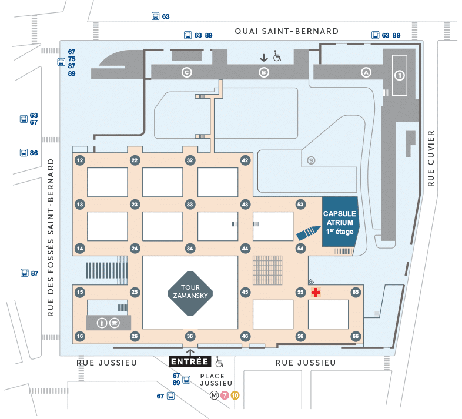

## Accelerate your omics analyses with InforBio

We provide biological researchers with statistical and bioinformatics expertise, analysis tools, and high performance computing resources.
Our team covers a broad range of applications, with specific core expertise in transcriptomics and epigenetics.

## Contact Us

{width=300px}
<!-- 
to create a google formula for the contact

nom/prenom:
lab / structure / organisme (optionel)
type de demande (memu deroulant): formation, infrastructure, collaboration, etc.
description/message
votre mail: -->

Adresse: 
Institut de Biologie Paris-Seine,
Bâtiment B, 7e étage, porte 725,
7-9 Quai St Bernard

{width=500px}

<!-- {data-icon=laptop} service
{data-icon=graduation-cap} trainings
icon storage pour serveur de stockage -->

## Members

- [Lorette Noiret](https://github.com/NoiretLorette) - Scientific Head
- [Naïra Naouar](https://github.com/NairaNaouar) - Operation Manager
- [Lijiao Ning](https://github.com/Ning-L) - Biostatistician
- [Abdel Mounim Essabbar](https://github.com/mouneem) - Research Fellow 
- [Ivain Raslain](https://github.com/ivain-r) - PhD Student
- [Joe Ueda](https://github.com/jueda99) - Bioinformatician
